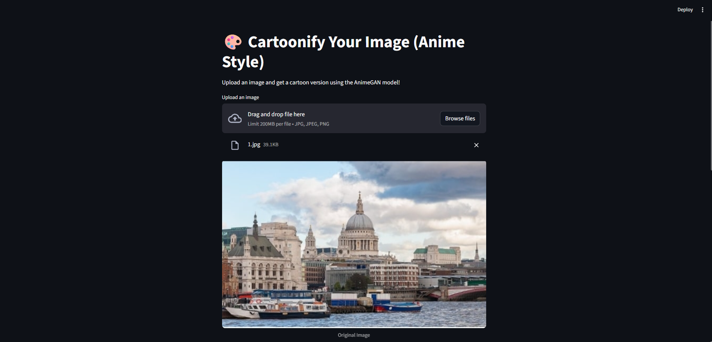
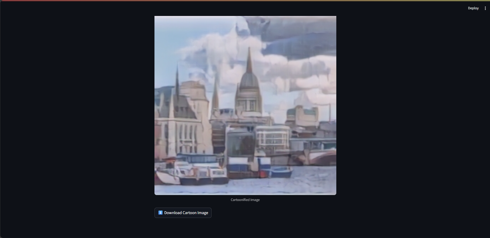

# 🖼️ AnimeGANv2 Cartoonifier (Shinkai Style)

A simple web app built with **Streamlit** that cartoonifies real-world images into anime-style art using the **AnimeGANv2 - Shinkai v2 model** (`Shinkai_53.pb`).

## 🚀 Features

- Upload any image and convert it into anime-style instantly
- Powered by the pre-trained TensorFlow `.pb` model from AnimeGANv2
- Clean and user-friendly Streamlit interface
- Processes images locally (no internet required)

---
## 🧠 Model Used

- **AnimeGANv2 Shinkai v2**  
- Model file: `Shinkai_53.pb`  
- Framework: TensorFlow  
- Style inspiration: Makoto Shinkai's anime visuals
---
## 🛠️ Tech Stack

- Python 3.x
- Streamlit
- TensorFlow
- OpenCV
- NumPy
---
## 🖼️ Screenshots

### Original Image Upload

### Cartoon Image   

---
